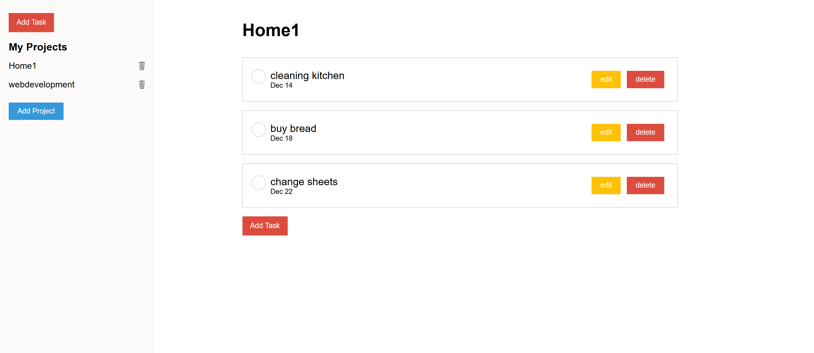

# Todo App

This is a SPA (Single Page Application) built in WebPack

## How to Access Weather App

E-commerce is hosted on **GitHub PAges**. You can access it [here](https://girofrm.github.io/todo-list/).

## Features
- **Add New Project**: A new project will be shown on the navBar at the left
- **Add New Todo**: A new Todo will be assigned to a specific project
- **toggle off completed Todo**: A Todo completed can be ticked off and deactivated
- **Edit Todo**: It allows to edit Todo fields(Name, Data, Description, priority, project)
- **Responsive Design**: Ensures a responsive design for all screen sizes.
- **Accessibility**: Follows web accessibility guidelines to ensure a usable experience for all users.

## Tech Stack

- **Webpack**:
- **JavaScript**
- **HTML & CSS**

## Deployment

Deployed on **Git Pages** for fast and reliable hosting.
